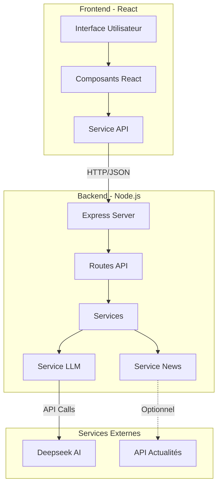
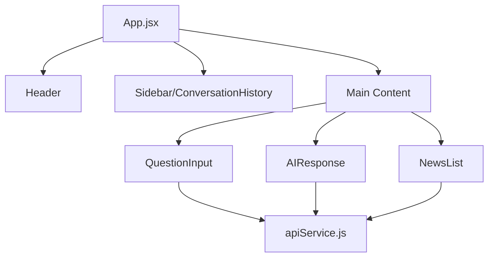
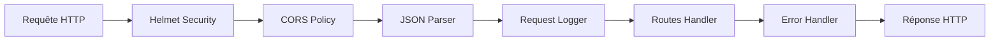
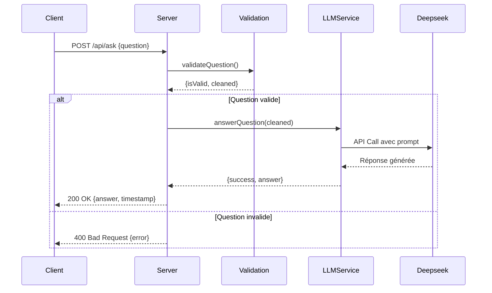
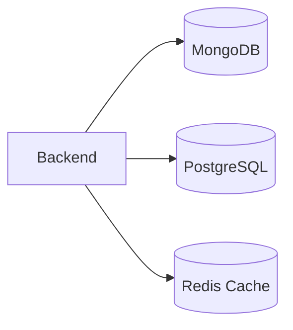
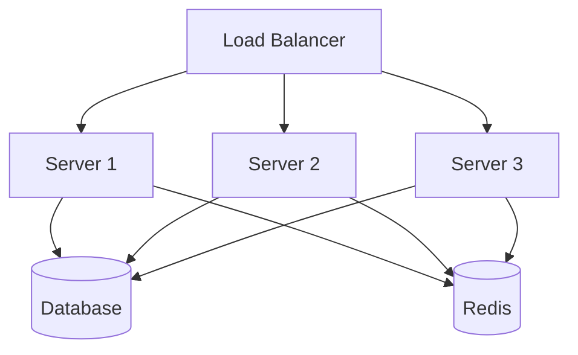

# Architecture NewsPulse

Documentation technique de l'architecture de la plateforme NewsPulse.

## Vue d'Ensemble

NewsPulse est une application web full-stack qui combine React pour le frontend et Node.js/Express pour le backend, avec intégration de Deepseek AI pour les fonctionnalités d'intelligence artificielle.

## Architecture Globale



## Architecture Frontend

### Structure des Composants



### Flux de Données Frontend

1. **Utilisateur pose une question** → `QuestionInput`
2. **Validation locale** → Vérification longueur, caractères
3. **Appel API** → `apiService.askQuestion()`
4. **État React** → Mise à jour `currentResponse` et `conversationHistory`
5. **Affichage** → `AIResponse` et `ConversationHistory`

### Design System

Le design system est centralisé dans `design-system.css` avec :

- **Variables CSS** pour couleurs, espacements, typographie
- **Classes utilitaires** pour layouts flexbox/grid
- **Composants stylisés** (buttons, cards, inputs)
- **Animations** et transitions fluides
- **Responsive breakpoints** (mobile, tablet, desktop)

**Palette de couleurs** :
- Primaire : `#1E90FF` (Bleu électrique)
- Secondaire : `#F5F7FA` (Gris clair)
- Accent : `#FFB800` (Jaune) / `#FF6B35` (Orange)

## Architecture Backend

### Structure Modulaire

```
backend/src/
├── server.js           # Point d'entrée, configuration Express
├── routes/             # Endpoints API
│   ├── newsRoutes.js
│   ├── llmRoutes.js
│   └── healthRoutes.js
├── services/           # Logique métier
│   ├── llmService.js   # Intégration Deepseek
│   └── newsService.js  # Gestion actualités
└── utils/              # Utilitaires
    ├── constants.js    # Templates prompts, constantes
    └── validation.js   # Validation & sanitization
```

### Middleware Stack



### Flux de Traitement d'une Question



## Service LLM (Deepseek)

### Fonctionnement

1. **Initialisation** : Chargement de la clé API au démarrage
2. **Templates de Prompts** : Prompts structurés pour résumé/explication/question
3. **Appel API** : Utilisation du client/API Deepseek
4. **Configuration** : Temperature, tokens, top-p/top-k
5. **Mode Mock** : Réponses simulées si pas de clé API

### Templates de Prompts

Tous les prompts sont dans `constants.js` :

- **QUESTION_ANSWER** : Répond aux questions générales
- **SUMMARY** : Résume un texte en 3-5 phrases
- **EXPLANATION** : Explique un sujet de façon pédagogique

Chaque template inclut :
- Rôle de l'IA (professeur, assistant)
- Instructions précises (langue, format, ton)
- Placeholders `{question}`, `{text}`, `{topic}`, `{context}`

## Sécurité

### Mesures Implémentées

1. **Helmet.js** : Headers HTTP sécurisés
2. **CORS Policy** : Origines autorisées uniquement
3. **Input Validation** : Sanitization de tous les inputs
4. **Rate Limiting** : Prêt pour ajout (express-rate-limit)
5. **Injection Prevention** : Suppression tags HTML/scripts
6. **Environment Variables** : Secrets dans .env

### Validation des Entrées

```javascript
// Exemple de flux de validation
Input → sanitizeText() → validateQuestion() → isSuspicious()
```

- Suppression balises HTML
- Nettoyage caractères de contrôle
- Vérification longueur min/max
- Détection patterns suspects

## Base de Données

**Note** : La version actuelle n'utilise pas de base de données.

- Actualités : Mock data en mémoire
- Historique : État React côté client
- Sessions : Non persistées

### Extension Future

Pour ajouter une base de données :



Recommandations :
- **MongoDB** pour stockage documents (articles, historique)
- **Redis** pour cache et sessions
- **PostgreSQL** pour données relationnelles

## API REST

### Principes

- **Stateless** : Chaque requête est indépendante
- **JSON** : Format d'échange unique
- **HTTP verbs** : GET (lecture), POST (création/action)
- **Status codes** : 200 (succès), 400 (client), 500 (serveur)

### Structure des Réponses

```json
{
  "success": true,
  "data": {...},
  "timestamp": "2026-01-28T12:00:00Z"
}
```

En cas d'erreur :
```json
{
  "success": false,
  "error": "Message descriptif"
}
```

## Performance

### Optimisations Frontend

- **Code Splitting** : Vite génère des chunks optimisés
- **Lazy Loading** : Import composants à la demande
- **Memoization** : React.memo pour composants purs
- **Debouncing** : Sur événements fréquents (search)

### Optimisations Backend

- **Compression** : Gzip des réponses (à activer)
- **Caching** : Headers cache pour ressources statiques
- **Connection Pooling** : Pour futures connexions DB
- **Async/Await** : Opérations non-bloquantes

## Scalabilité

### Horizontal Scaling

Pour gérer plus de charge :



### Recommandations

1. **Load Balancer** : Nginx ou AWS ELB
2. **Instances multiples** : PM2 avec cluster mode
3. **Cache distribué** : Redis pour partage d'état
4. **CDN** : Pour assets statiques frontend

## Monitoring & Logs

### À Implémenter

- **Logs structurés** : Winston ou Pino
- **Monitoring** : Prometheus + Grafana
- **APM** : New Relic ou DataDog
- **Error Tracking** : Sentry

### Métriques Clés

- Temps de réponse API
- Taux d'erreur
- Utilisation CPU/mémoire
- Requêtes par seconde
- Latence Deepseek API

## Déploiement

### Options Recommandées

**Frontend** :
- Vercel (recommandé pour React)
- Netlify
- AWS S3 + CloudFront

**Backend** :
- Railway
- Render
- AWS EC2 / ECS
- Google Cloud Run

### Variables d'Environnement Production

```env
NODE_ENV=production
PORT=8080
DEESEEK_API_KEY=***
ALLOWED_ORIGINS=https://newspulse.app
```

## Choix Techniques Justifiés

### Pourquoi React ?
- Écosystème mature
- Composants réutilisables
- Virtual DOM performant
- Grande communauté

### Pourquoi Express ?
- Minimaliste et flexible
- Middleware ecosystem riche
- Performance éprouvée
- JavaScript full-stack

### Pourquoi Deepseek ?
- Modèle de langage performant
- API simple d'utilisation
- Support multilingue
- Coût adapté selon usage

## Conclusion

NewsPulse démontre une architecture moderne, modulaire et scalable, prête pour l'intégration en production. Le code est documenté, sécurisé et suit les meilleures pratiques du développement full-stack.
